# 从原工作空间集成 Go2W + RL-SAR 导航的完整修改说明

## 1. 文档目的

本文说明如何以原始工作空间：

```text
mobile-robot-planning-copy/mobile-robot-planning-copy
```

为起点，将 RL-SAR 的 Go2W 轮足机器人模型、强化学习运动策略和 ROS Navigation 导航链路整合到：

```text
mobile-robot-planning
```

最终目标如下：

- Gazebo 仿真世界使用 `mr_gazebo/worlds/maze_2.world`。
- Navigation 使用静态地图 `mr_maps/maps/maze_2_hector.yaml`。
- 机器人模型使用 `go2w_description`。
- 机器人运动控制使用 RL-SAR 的 `go2w/robot_lab` 策略。
- RViz 中通过 `2D Nav Goal` 发送导航目标。
- Navfn 生成全局路径，DWA 生成局部速度。
- DWA 输出先经过 Go2W 专用速度过滤，再交给 RL-SAR。
- RL-SAR 将 `cmd_vel` 转换为策略观测中的 `commands`。
- 策略输出最终驱动 Gazebo 中的 Go2W 关节和轮子。

本文的修改结论来自以下三组代码的实际对比：

1. 原始工作空间：`mobile-robot-planning-copy/mobile-robot-planning-copy`
2. 当前工作空间：`mobile-robot-planning`
3. RL-SAR 上游代码：`rl_sar-main`

> 注意：本文以当前目录中的实际代码为准，而不是以早期调试记录中的临时参数为准。

---

## 2. 原工作空间为什么不能直接运行 Go2W

原始工作空间已经具有 TurtleBot3 建图与导航的基本结构：

```text
mr_description
mr_gazebo
mr_learning
mr_maps
mr_msgs
mr_navigation
mr_slam
mr_traditional_planner
```

但它还缺少完成 Go2W 导航闭环所需的以下部分：

1. **没有 Go2W URDF、网格、Gazebo 插件和关节控制器配置。**
2. **没有 RL-SAR 控制节点和 Go2W 策略文件。**
3. **没有 `robot_msgs`，无法生成 RL-SAR 控制器所需的电机消息。**
4. **没有 `robot_joint_controller`，无法在 Gazebo 中接收 RL-SAR 的关节命令。**
5. **没有 Go2W 激光雷达，Navigation 无法获得 `/scan`。**
6. **Go2W Gazebo 模型没有标准 `/odom` 和 `odom -> base_footprint` TF。**
7. **原导航参数主要按 TurtleBot3 Burger 的尺寸和运动能力设计。**
8. **原 `move_base` 直接向 `/cmd_vel` 发布，速度跳变不适合直接送入 RL 策略。**
9. **原 RL-SAR 需要键盘手动完成起立和进入 locomotion，不适合一键导航。**
10. **RL-SAR 默认会编译真机目标，而当前源码中没有完整的 Unitree SDK 子模块。**
11. **原工作空间中没有 `maze_2`、`maze_2_hector` 地图文件。**

因此，不能只把 Go2W 模型放进 Gazebo；必须同时补齐模型、传感器、TF、里程计、导航参数、速度接口和 RL 状态机。

---

## 3. 集成后的完整数据流

```mermaid
flowchart LR
    Goal["RViz 2D Nav Goal"] --> Navfn["NavfnROS 全局规划"]
    Navfn --> DWA["DWAPlannerROS 局部规划"]
    DWA --> RawCmd["/move_base_cmd_vel"]
    RawCmd --> Filter["cmd_vel_filter.py"]
    Filter --> Cmd["/cmd_vel"]
    Cmd --> RLSAR["rl_sar / rl_sim"]
    RLSAR --> Policy["go2w/robot_lab/policy.pt"]
    Policy --> JointCmd["RobotCommand / MotorCommand"]
    JointCmd --> Controllers["robot_joint_controller"]
    Controllers --> Gazebo["Gazebo Go2W"]

    Gazebo --> ModelStates["/gazebo/model_states"]
    ModelStates --> OdomBridge["gazebo_model_odom.py"]
    OdomBridge --> Odom["/odom + odom -> base_footprint"]
    Odom --> AMCL["AMCL"]
    AMCL --> MapTF["map -> odom"]
    MapTF --> Navfn

    Gazebo --> Scan["/scan"]
    Scan --> AMCL
    Scan --> DWA
```



最终应形成下面这条 TF 主链：

```text
map
└── odom
    └── base_footprint
        └── base
            └── trunk
                └── base_scan
```

各段来源如下：

| TF | 发布者 |
|---|---|
| `map -> odom` | AMCL |
| `odom -> base_footprint` | `gazebo_model_odom.py` |
| `base_footprint -> base` | `static_transform_publisher` |
| `base -> trunk -> ...` | `robot_state_publisher` |
| `trunk -> base_scan` | Go2W URDF 固定关节 |

---

## 4. 文件级修改总览

### 4.1 从 RL-SAR 上游引入的新目录

需要从 `rl_sar-main` 引入：

| 上游路径 | 工作空间目标路径 | 用途 |
|---|---|---|
| `src/rl_sar` | `src/rl_sar` | RL 推理、FSM、Gazebo 仿真控制 |
| `src/robot_msgs` | `src/robot_msgs` | 电机和机器人状态消息 |
| `src/robot_joint_controller` | `src/robot_joint_controller` | Gazebo ROS-Control 控制器 |
| `src/rl_sar_zoo/go2w_description` | `src/go2w_description` | Go2W URDF、网格、Gazebo 配置 |
| `policy/go2w` | `policy/go2w` | Go2W 基础参数和 `robot_lab` 策略 |
| `scripts` | `scripts` | LibTorch/ONNX Runtime 下载脚本 |

### 4.2 当前工作空间新增的自定义文件

| 文件 | 作用 |
|---|---|
| `src/mr_navigation/launch/go2w_navigation_sim.launch` | Go2W 导航总入口 |
| `src/mr_navigation/scripts/cmd_vel_filter.py` | 速度限幅、平滑、频率同步和到点停车 |
| `src/mr_gazebo/scripts/gazebo_model_odom.py` | 从 Gazebo 模型状态生成平面里程计和 TF |
| `src/mr_navigation/config/costmap_common_params_go2w.yaml` | Go2W footprint 和障碍物参数 |
| `src/mr_navigation/config/dwa_local_planner_params_go2w.yaml` | Go2W DWA 速度与轨迹评分参数 |
| `src/mr_maps/maps/maze_2.pgm/.yaml` | `maze_2` 地图 |
| `src/mr_maps/maps/maze_2_hector.pgm/.yaml` | Hector 保存的导航地图 |

当前目录中若出现：

```text
src/mr_navigation/scripts/__pycache__/
```

它只是 Python 自动生成的字节码缓存，不属于迁移内容，不应提交或复制到新工作空间。

### 4.3 原有包中与 Go2W 集成直接相关的修改

```text
src/mr_gazebo/CMakeLists.txt
src/mr_gazebo/package.xml
src/mr_maps/launch/map_loader.launch
src/mr_navigation/CMakeLists.txt
src/mr_navigation/package.xml
src/mr_navigation/launch/amcl.launch
src/mr_navigation/launch/navigation.launch
src/mr_navigation/launch/move_base.launch
```

### 4.4 当前版中存在、但不是 Go2W 集成必需的其他修改

与 `mobile-robot-planning-copy` 对比时还发现：

```text
src/mr_description/urdf/turtlebot3_burger.gazebo.xacro
src/mr_navigation/config/costmap_common_params_burger.yaml
src/mr_navigation/config/dwa_local_planner_params_burger.yaml
src/mr_slam/config/gmapping_params.yaml
src/mr_slam/config/hector.yaml
src/mr_slam/launch/hector.launch
src/mr_slam/launch/slam_sim.launch
```

这些主要属于 TurtleBot3 建图、激光频率或避障参数调整，不是让 Go2W 导航运行的硬性条件。迁移时可按需求保留，但不要把它们和 Go2W 必需修改混在一起。

---

## 5. 第一步：复制 RL-SAR 所需包

假设两个工程位于同一级目录：

```text
~/mobile-robot-planning
~/rl_sar-main
```

在 Ubuntu 中执行：

```bash
cd ~/mobile-robot-planning

cp -a ../rl_sar-main/src/rl_sar src/
cp -a ../rl_sar-main/src/robot_msgs src/
cp -a ../rl_sar-main/src/robot_joint_controller src/
cp -a ../rl_sar-main/src/rl_sar_zoo/go2w_description src/

mkdir -p policy
cp -a ../rl_sar-main/policy/go2w policy/

cp -a ../rl_sar-main/scripts .
```

不要复制 RL-SAR 上游自己的 `build`、`devel` 或完整工作空间元数据。

当前项目只需要把相关包整合进原来的 Catkin 工作空间，由 `mobile-robot-planning` 统一编译。

---

## 6. 第二步：为 ROS 1 选择正确的 package.xml

RL-SAR 同时兼容 ROS 1 和 ROS 2，上游目录中通常包含：

```text
package.ros1.xml
package.ros2.xml
package.xml
```

本项目使用 Ubuntu 20.04 + ROS Noetic，因此应让 Catkin 读取 ROS 1 版本：

```bash
cd ~/mobile-robot-planning

cp src/rl_sar/package.ros1.xml src/rl_sar/package.xml
cp src/robot_msgs/package.ros1.xml src/robot_msgs/package.xml
cp src/robot_joint_controller/package.ros1.xml src/robot_joint_controller/package.xml
cp src/go2w_description/package.ros1.xml src/go2w_description/package.xml
```

随后在 `src/go2w_description/package.xml` 中补充传感器和 Xacro 所需依赖：

```xml
<depend>gazebo_plugins</depend>
<depend>gazebo_ros</depend>
<depend>xacro</depend>
```

当前 `go2w_description/package.xml` 相对上游 ROS 1 文件的语义修改只有这三项依赖。

---

## 7. 第三步：准备推理运行时和策略

### 7.1 策略目录结构

必须保证以下路径存在：

```text
policy/
└── go2w/
    ├── base.yaml
    └── robot_lab/
        ├── config.yaml
        └── policy.pt
```

当前模型使用：

```text
go2w/robot_lab
```

其中：

- `base.yaml` 描述 Go2W 的 16 个自由度、关节顺序、PD 参数、轮子索引和控制周期。
- `robot_lab/config.yaml` 描述策略输入、输出、缩放和模型名称。
- `robot_lab/policy.pt` 是 TorchScript 策略。

当前 `base.yaml` 中：

```yaml
dt: 0.005
decimation: 4
```

因此策略推理周期为：

```text
0.005 × 4 = 0.02 s
```

即：

```text
50 Hz
```

这表示 RL 内部可以按 50 Hz 执行策略，但不代表 Navigation 必须以 50 Hz 更新目标速度。当前导航速度链统一设置为 20 Hz，以减少速度命令抖动并保留足够响应速度。

### 7.2 下载 LibTorch

当前策略文件是 `.pt`，至少需要 LibTorch：

```bash
cd ~/mobile-robot-planning
bash scripts/download_inference_runtime.sh libtorch
```

脚本默认将运行时放到：

```text
library/inference_runtime/libtorch
```

而 `src/rl_sar/CMakeLists.txt` 通过：

```cmake
get_filename_component(PROJECT_ROOT_DIR "${CMAKE_CURRENT_SOURCE_DIR}/../.." ABSOLUTE)
set(INFERENCE_RUNTIME_DIR "${PROJECT_ROOT_DIR}/library/inference_runtime")
add_definitions(-DPOLICY_DIR="${PROJECT_ROOT_DIR}/policy")
```

定位工作空间根目录下的 `policy` 和 `library`。

如果没有 `library/inference_runtime/libtorch/include` 和 `lib`，RL-SAR 无法使用 `policy.pt` 完成推理。

---

## 8. 第四步：修复 RL-SAR 在统一 Catkin 工作空间中的编译

### 8.1 禁用不需要的真机目标

上游 RL-SAR 会尝试编译 Unitree、Lite3 等真实机器人目标。一些厂商 SDK 通过 Git 子模块提供；如果只复制普通目录，可能出现：

```text
The source directory .../unitree_sdk2 does not contain a CMakeLists.txt file
```

在 `src/rl_sar/CMakeLists.txt` 中增加：

```cmake
option(
  BUILD_RL_REAL_TARGETS
  "Build real-robot hardware executables that require vendor SDKs"
  OFF
)
```

所有真机 SDK 和真机可执行文件都应受该开关控制，例如：

```cmake
set(HAVE_UNITREE_SDK2 OFF)

if(SYSTEM_TYPE STREQUAL "Linux" AND BUILD_RL_REAL_TARGETS)
  set(UNITREE_SDK2_DIR
      "${CMAKE_CURRENT_SOURCE_DIR}/library/thirdparty/robot_sdk/unitree/unitree_sdk2")

  if(EXISTS "${UNITREE_SDK2_DIR}/CMakeLists.txt")
    set(BUILD_EXAMPLES OFF CACHE BOOL "Disable examples build for unitree_sdk2" FORCE)
    add_subdirectory(library/thirdparty/robot_sdk/unitree/unitree_sdk2)
    set(HAVE_UNITREE_SDK2 ON)
  else()
    message(WARNING
      "unitree_sdk2 not found; rl_real_go2 and rl_real_g1 will be skipped")
  endif()
endif()
```

真机目标也应附加条件：

```cmake
if(SYSTEM_TYPE STREQUAL "Linux"
   AND BUILD_RL_REAL_TARGETS
   AND HAVE_UNITREE_SDK2)
  add_executable(rl_real_go2 src/rl_real_go2.cpp)
  ...
endif()
```

仿真编译统一使用：

```bash
catkin_make -DBUILD_RL_REAL_TARGETS=OFF
```

### 8.2 修复 robot_msgs 消息生成顺序

曾出现：

```text
fatal error: robot_msgs/MotorCommand.h: No such file or directory
```

原因不是 `.msg` 文件缺失，而是并行编译时 `robot_joint_controller` 比消息头生成得更早。

在 `src/robot_joint_controller/CMakeLists.txt` 的 ROS 1 分支中增加：

```cmake
add_library(robot_joint_controller
  ros/src/robot_joint_controller.cpp
)

add_dependencies(
  robot_joint_controller
  ${catkin_EXPORTED_TARGETS}
)

target_link_libraries(
  robot_joint_controller
  ${catkin_LIBRARIES}
)
```

同时在 `src/rl_sar/CMakeLists.txt` 中为仿真节点增加：

```cmake
add_executable(rl_sim src/rl_sim.cpp)
add_dependencies(rl_sim ${catkin_EXPORTED_TARGETS})
```

这样会先生成：

```text
robot_msgs/MotorCommand.h
robot_msgs/MotorState.h
robot_msgs/RobotCommand.h
robot_msgs/RobotState.h
```

再编译依赖它们的目标。

### 8.3 修复 robot_msgs 不存在 include 目录的问题

上游 `robot_msgs/CMakeLists.txt` 会直接安装：

```text
include/robot_msgs
```

但当前消息包没有这个目录，配置阶段可能失败。改成：

```cmake
if(EXISTS ${CMAKE_CURRENT_SOURCE_DIR}/include/${PROJECT_NAME})
  install(
    DIRECTORY include/${PROJECT_NAME}/
    DESTINATION ${CATKIN_PACKAGE_INCLUDE_DESTINATION}
    FILES_MATCHING PATTERN "*.h"
  )
endif()
```

---

## 9. 第五步：给 Go2W 增加导航激光雷达

RL-SAR 上游 Go2W 模型主要用于运动控制，本身没有满足本项目 Navigation 接口的 2D 激光。

### 9.1 增加 base_scan

修改：

```text
src/go2w_description/xacro/robot.xacro
```

在 `trunk` 上增加 `base_scan`：

```xml
<link name="base_scan">
  <visual>
    <origin xyz="0 0 0" rpy="0 0 0"/>
    <geometry>
      <cylinder radius="0.035" length="0.035"/>
    </geometry>
    <material name="base_scan_black">
      <color rgba="0.02 0.02 0.02 1.0"/>
    </material>
  </visual>

  <collision>
    <origin xyz="0 0 0" rpy="0 0 0"/>
    <geometry>
      <cylinder radius="0.035" length="0.035"/>
    </geometry>
  </collision>

  <inertial>
    <mass value="0.02"/>
    <origin xyz="0 0 0" rpy="0 0 0"/>
    <inertia
      ixx="1e-5" ixy="0" ixz="0"
      iyy="1e-5" iyz="0" izz="1e-5"/>
  </inertial>
</link>

<joint name="base_scan_joint" type="fixed">
  <origin xyz="0 0 0.20" rpy="0 0 0"/>
  <parent link="trunk"/>
  <child link="base_scan"/>
</joint>
```

当前雷达位置为：

```text
trunk 正中心上方 0.20 m
```

这样可以避免扫描平面穿过躯干或轮腿，并使 RViz 中激光位置与机器人模型一致。

### 9.2 增加 Gazebo ray sensor

修改：

```text
src/go2w_description/xacro/gazebo.xacro
```

增加：

```xml
<gazebo reference="base_scan">
  <material>Gazebo/FlatBlack</material>

  <sensor type="ray" name="go2w_laser">
    <pose>0 0 0 0 0 0</pose>
    <visualize>false</visualize>
    <update_rate>10</update_rate>

    <ray>
      <scan>
        <horizontal>
          <samples>720</samples>
          <resolution>1</resolution>
          <min_angle>-3.14159</min_angle>
          <max_angle>3.14159</max_angle>
        </horizontal>
      </scan>

      <range>
        <min>0.12</min>
        <max>10.0</max>
        <resolution>0.01</resolution>
      </range>

      <noise>
        <type>gaussian</type>
        <mean>0.0</mean>
        <stddev>0.01</stddev>
      </noise>
    </ray>

    <plugin
      name="go2w_laser_controller"
      filename="libgazebo_ros_laser.so">
      <topicName>scan</topicName>
      <frameName>base_scan</frameName>
    </plugin>
  </sensor>
</gazebo>
```

最终传感器接口为：

```text
Topic: /scan
Type: sensor_msgs/LaserScan
Frame: base_scan
Rate: 10 Hz
Range: 0.12 m - 10.0 m
FOV: 360°
Samples: 720
```

---

## 10. 第六步：增加 maze_2 和 maze_2_hector 地图

在 `src/mr_maps/maps` 下加入：

```text
maze_2.pgm
maze_2.yaml
maze_2_hector.pgm
maze_2_hector.yaml
```

当前导航使用：

```yaml
image: maze_2_hector.pgm
resolution: 0.050000
origin: [-51.224998, -51.224998, 0.000000]
negate: 0
occupied_thresh: 0.65
free_thresh: 0.196
```

地图 YAML 中应使用相对图片路径：

```yaml
image: maze_2_hector.pgm
```

不要写成：

```yaml
image: /home/某个用户名/mobile-robot-planning/...
```

否则换电脑、换用户名或移动工作空间后，`map_server` 会找不到图片。

`src/mr_maps/launch/map_loader.launch` 本身已经通过参数拼接：

```xml
<arg name="map_name" default="turtlebot3_world"/>

<node
  pkg="map_server"
  type="map_server"
  name="map_server"
  args="$(find mr_maps)/maps/$(arg map_name).yaml"/>
```

因此只需传入：

```text
map_name:=maze_2_hector
```

---

## 11. 第七步：为 Go2W 生成标准平面里程计

### 11.1 为什么不能直接使用模型姿态

Gazebo 的 `/gazebo/model_states` 提供世界坐标中的 6 DoF 姿态和速度，但 Navigation 需要：

```text
nav_msgs/Odometry
odom -> base_footprint
```

同时，轮足机器人运动时会发生轻微俯仰、横滚和高度变化。若把完整 3D 姿态直接送入二维导航，RViz 中可能看到机器人落到地图平面以下，局部代价地图也可能出现 TF 抖动。

### 11.2 新增 gazebo_model_odom.py

新增：

```text
src/mr_gazebo/scripts/gazebo_model_odom.py
```

它执行以下工作：

1. 订阅 `/gazebo/model_states`。
2. 按模型名查找 `go2w_gazebo`，不使用固定数组下标。
3. 保留世界坐标中的 `x`、`y` 和 `yaw`。
4. 将里程计 `z` 固定为 `0`。
5. 将姿态限制为纯偏航四元数。
6. 将 Gazebo 世界坐标速度转换到机器人机体坐标系。
7. 发布 `/odom`。
8. 发布 `odom -> base_footprint`。
9. 默认以 30 Hz 更新。

关键的速度变换为：

```python
body_vx = cos_yaw * world_vx + sin_yaw * world_vy
body_vy = -sin_yaw * world_vx + cos_yaw * world_vy
```

Navigation 中 `Odometry.twist` 应表达在 `child_frame_id` 对应的机体坐标系中，因此不能直接把 Gazebo 世界坐标速度原样复制。

### 11.3 安装 Python 节点

修改 `src/mr_gazebo/CMakeLists.txt`：

```cmake
catkin_install_python(PROGRAMS
  scripts/gazebo_model_odom.py
  DESTINATION ${CATKIN_PACKAGE_BIN_DESTINATION}
)
```

修改 `src/mr_gazebo/package.xml`，增加：

```xml
<depend>gazebo_msgs</depend>
<depend>nav_msgs</depend>
<depend>rospy</depend>
<depend>tf</depend>
<exec_depend>go2w_description</exec_depend>
```

---

## 12. 第八步：修正 Go2W 在 RViz 中的高度和 TF

Go2W 上游 URDF 的根部结构为：

```text
base
└── floating_base 固定关节
    └── trunk
```

其中 `base` 是一个很小的虚拟根链接，`base -> trunk` 的偏移为 0。

Navigation 以 `base_footprint` 表示机器人在地面的二维投影，因此在总启动文件中增加：

```xml
<node
  pkg="tf"
  type="static_transform_publisher"
  name="tf_base_footprint_base"
  args="0 0 $(arg robot_base_height) 0 0 0 base_footprint base 50"/>
```

当前：

```xml
<arg name="robot_base_height" default="0.34"/>
```

其含义是：

```text
base 位于 base_footprint 上方 0.34 m
```

如果 RViz 中机器人明显位于地图平面以下：

1. 检查 `odom -> base_footprint` 的 `z` 是否为 0。
2. 检查 `base_footprint -> base` 是否存在。
3. 适当增大 `robot_base_height`。
4. 不要让多个节点同时发布同一段 TF。

验证：

```bash
rosrun tf tf_echo odom base_footprint
rosrun tf tf_echo base_footprint base
rosrun tf tf_echo base base_scan
```

---

## 13. 第九步：扩展 AMCL 和 move_base 参数入口

### 13.1 amcl.launch

在 `src/mr_navigation/launch/amcl.launch` 中增加：

```xml
<arg name="odom_model_type" default="diff"/>
```

并将固定参数：

```xml
<param name="odom_model_type" value="diff"/>
```

改成：

```xml
<param name="odom_model_type" value="$(arg odom_model_type)"/>
<param name="odom_alpha5" value="0.1"/>
```

初始位姿继续通过：

```xml
<arg name="initial_pose_x" default="0.0"/>
<arg name="initial_pose_y" default="0.0"/>
<arg name="initial_pose_a" default="0.0"/>
```

传入 AMCL。

Go2W 当前仍使用：

```text
odom_model_type:=diff
```

原因是速度过滤层关闭了侧向速度，导航行为按“前进 + 偏航”实现。

### 13.2 navigation.launch

在 `src/mr_navigation/launch/navigation.launch` 增加：

```xml
<arg name="odom_model_type" default="diff"/>
<arg name="controller_frequency" default="10.0"/>
```

并将其分别传给 AMCL 和 `move_base.launch`：

```xml
<include file="$(find mr_navigation)/launch/amcl.launch">
  ...
  <arg name="odom_model_type" value="$(arg odom_model_type)"/>
</include>

<include file="$(find mr_navigation)/launch/move_base.launch">
  ...
  <arg name="controller_frequency" value="$(arg controller_frequency)"/>
</include>
```

### 13.3 move_base.launch

增加：

```xml
<arg name="controller_frequency" default="10.0"/>
```

并在 `move_base` 节点内覆盖通用配置：

```xml
<param name="controller_frequency" value="$(arg controller_frequency)"/>
```

这样 Go2W 总启动文件可以把：

```text
move_base 控制频率
速度过滤器发布频率
RL-SAR cmd_vel 接收上限
```

统一设置为 20 Hz。

---

## 14. 第十步：增加 Go2W 专用 costmap 参数

新增：

```text
src/mr_navigation/config/costmap_common_params_go2w.yaml
```

当前主要参数为：

```yaml
obstacle_range: 4.0
raytrace_range: 5.0

footprint:
  [[-0.35, -0.22],
   [-0.35,  0.22],
   [ 0.35,  0.22],
   [ 0.35, -0.22]]

inflation_radius: 0.35
cost_scaling_factor: 3.0

map_type: costmap
observation_sources: scan

scan:
  sensor_frame: base_scan
  data_type: LaserScan
  topic: /scan
  marking: true
  clearing: true
```

关键点：

1. `footprint` 必须按 Go2W 实际外包络设置，不能继续使用 Burger 的小尺寸。
2. `sensor_frame` 必须与激光消息中的 `frame_id` 一致。
3. `/scan` 必须既用于 marking，也用于 clearing。
4. `obstacle_range` 不应超过有效激光范围。
5. footprint 过大时，机器人可能在窄通道中无路可走；过小时会贴墙碰撞。

---

## 15. 第十一步：增加 Go2W 专用 DWA 参数

新增：

```text
src/mr_navigation/config/dwa_local_planner_params_go2w.yaml
```

当前实际参数如下：

```yaml
DWAPlannerROS:
  max_vel_x: 0.65
  min_vel_x: 0.16

  max_vel_y: 0.0
  min_vel_y: 0.0

  max_vel_trans: 0.65
  min_vel_trans: 0.16

  max_vel_theta: 1.0
  min_vel_theta: 0.18

  acc_lim_x: 0.9
  acc_lim_y: 0.0
  acc_lim_theta: 1.4

  xy_goal_tolerance: 0.22
  yaw_goal_tolerance: 3.14159
  latch_xy_goal_tolerance: true

  sim_time: 1.5
  vx_samples: 20
  vy_samples: 0
  vth_samples: 20
  controller_frequency: 10.0

  path_distance_bias: 32.0
  goal_distance_bias: 24.0
  occdist_scale: 0.08
  forward_point_distance: 0.325
  stop_time_buffer: 0.2
  scaling_speed: 0.2
  max_scaling_factor: 0.2

  oscillation_reset_dist: 0.05
  publish_traj_pc: true
  publish_cost_grid_pc: true
```

### 15.1 为什么 y 速度设为 0

`geometry_msgs/Twist` 中：

```text
linear.x  前后速度
linear.y  左右侧移速度
angular.z 偏航角速度
```

这些速度以机器人机体坐标系为基准，不是地图坐标速度。

当前配置采用：

```text
linear.x + angular.z
```

即允许机器人边前进边轻微转弯，但不使用侧移：

```yaml
max_vel_y: 0.0
min_vel_y: 0.0
```

这样更容易让 DWA、AMCL、Go2W 策略和里程计模型保持一致。

### 15.2 为什么放宽终点 yaw 容差

机器人到达目标坐标后曾出现持续原地旋转。原因是 DWA 仍试图满足目标箭头方向，而任务更关心到达目标位置。

因此当前使用：

```yaml
xy_goal_tolerance: 0.22
yaw_goal_tolerance: 3.14159
latch_xy_goal_tolerance: true
```

这会弱化最终朝向要求，并在进入位置容差后锁存“已经到点”。

速度过滤器还会做第二层到点停车，防止 RL-SAR 持续接收残余角速度。

---

## 16. 第十二步：增加 cmd_vel 适配层

### 16.1 为什么不能让 move_base 直接控制 RL-SAR

直接连接：

```text
move_base /cmd_vel -> rl_sim
```

曾出现以下现象：

- 指令变化太快，机器人在原地抽动。
- 小速度低于策略可执行区间，机器人几乎不移动。
- 正负角速度频繁切换，机器人左右摆动。
- 到达目标位置后仍持续旋转。
- Navigation 和 RL-SAR 的更新频率不一致。

因此增加：

```text
src/mr_navigation/scripts/cmd_vel_filter.py
```

并将速度链改为：

```text
move_base
  -> /move_base_cmd_vel
  -> cmd_vel_filter.py
  -> /cmd_vel
  -> rl_sim
```

### 16.2 过滤器功能

当前过滤器具有：

1. 输入和输出话题可配置。
2. 固定频率发布。
3. 线速度、侧向速度、角速度限幅。
4. 最低前进速度。
5. 死区处理。
6. 加速和减速分别限幅。
7. 超时自动清零。
8. 可选原地转向模式。
9. 默认禁止侧移。
10. 基于 TF 计算目标距离。
11. 进入目标位置容差后锁存停车。
12. 对 NaN/Inf 命令进行保护。

### 16.3 最低速度

当前：

```text
min_x = 0.16 m/s
```

逻辑为：

```python
if value <= deadband_x:
    return 0.0
return clamp(value, min_x, max_x)
```

这不是“任何时刻都强制前进”，而是：

- 输入接近 0 时仍输出 0。
- 一旦规划器明确要求前进，就至少给出 `0.16 m/s`。

这样可以避免 DWA 输出很小的 `0.01~0.05 m/s`，导致 RL 策略只抖动而不产生有效位移。

### 16.4 加减速限制

使用：

```python
approach_with_limits(
    current,
    target,
    max_acc_delta,
    max_decel_delta,
)
```

当前默认：

```text
max_acc_x       = 0.60 m/s²
max_acc_yaw     = 1.00 rad/s²
max_decel_x     = 1.50 m/s²
max_decel_yaw   = 2.00 rad/s²
```

允许停车比起步更快，原因是：

- 起步过猛会使策略和轮子瞬间受到大命令。
- 到点或遇到超时时需要更快停住。

### 16.5 到点停车

过滤器订阅：

```text
/move_base/current_goal
```

并用 TF 查询目标坐标系到 `base_footprint` 的位置。

当：

```text
goal_distance <= 0.22 m
```

时：

```text
target = 0
goal_reached = true
```

且当前设置：

```text
goal_stop_latch = true
```

只有收到新目标后才解除停车锁存。

### 16.6 安装过滤器

修改 `src/mr_navigation/CMakeLists.txt`：

```cmake
catkin_install_python(PROGRAMS
  scripts/cmd_vel_filter.py
  DESTINATION ${CATKIN_PACKAGE_BIN_DESTINATION}
)
```

修改 `src/mr_navigation/package.xml`，增加：

```xml
<exec_depend>geometry_msgs</exec_depend>
<exec_depend>go2w_description</exec_depend>
<exec_depend>rl_sar</exec_depend>
<exec_depend>rospy</exec_depend>
<exec_depend>tf</exec_depend>
```

---

## 17. 第十三步：修改 RL-SAR 接收导航速度

RL-SAR 上游虽然订阅 `/cmd_vel`，但为了稳定地接入 Navigation，当前对：

```text
src/rl_sar/include/rl_sim.hpp
src/rl_sar/src/rl_sim.cpp
```

进行了扩展。

### 17.1 新增成员

在 `rl_sim.hpp` 中增加：

```cpp
std::string cmd_vel_topic = "/cmd_vel";
double cmd_vel_input_rate = 50.0;
std::mutex cmd_vel_mutex;

bool auto_start = false;
bool start_navigation = false;
bool auto_getup_requested = false;
double auto_locomotion_delay = 4.0;

ros::Time auto_start_time;
ros::Time last_cmd_vel_time;
```

并增加：

```cpp
#include <algorithm>
#include <iterator>
#include <mutex>
```

### 17.2 ROS 私有参数

构造函数读取：

```cpp
ros::NodeHandle private_nh("~");

private_nh.param<std::string>(
    "cmd_vel_topic",
    this->cmd_vel_topic,
    std::string("/cmd_vel"));

private_nh.param<double>(
    "cmd_vel_input_rate",
    this->cmd_vel_input_rate,
    50.0);

private_nh.param<bool>("auto_start", this->auto_start, false);
private_nh.param<bool>("start_navigation", this->start_navigation, false);

private_nh.param<double>(
    "auto_locomotion_delay",
    this->auto_locomotion_delay,
    4.0);
```

订阅话题从固定 `/cmd_vel` 改为：

```cpp
this->cmd_vel_subscriber =
    nh.subscribe<geometry_msgs::Twist>(
        this->cmd_vel_topic,
        10,
        &RL_Sim::CmdvelCallback,
        this);
```

### 17.3 限制 cmd_vel 接收频率

回调中加入：

```cpp
if (this->cmd_vel_input_rate > 0.0)
{
    const ros::Time now = ros::Time::now();

    if (!this->last_cmd_vel_time.isZero() &&
        (now - this->last_cmd_vel_time).toSec()
            < 1.0 / this->cmd_vel_input_rate)
    {
        return;
    }

    this->last_cmd_vel_time = now;
}
```

当前启动文件传入：

```text
cmd_vel_input_rate = 20 Hz
```

即使其他节点意外高频发布，RL-SAR 也不会无限频率地改写策略命令。

### 17.4 使用互斥锁

ROS 回调线程更新 `cmd_vel`，RL 推理线程读取 `cmd_vel`。为防止同时读写，使用：

```cpp
std::lock_guard<std::mutex> lock(this->cmd_vel_mutex);
```

写入端：

```cpp
this->cmd_vel = *msg;
```

读取端：

```cpp
this->obs.commands = {
    static_cast<float>(this->cmd_vel.linear.x),
    static_cast<float>(this->cmd_vel.linear.y),
    static_cast<float>(this->cmd_vel.angular.z)
};
```

### 17.5 自动进入导航模式

原 RL-SAR 仿真需要手动按键：

```text
Num0：从 Passive 进入 GetUp
Num1：从 GetUp 进入 RL Locomotion
```

当前在 `RobotControl()` 中增加自动状态切换：

```cpp
if (this->auto_start)
{
    const std::string state_name =
        this->fsm.current_state_
        ? this->fsm.current_state_->GetStateName()
        : "";

    if (!this->auto_getup_requested &&
        state_name == "RLFSMStatePassive")
    {
        this->control.SetKeyboard(Input::Keyboard::Num0);
        this->auto_getup_requested = true;
    }
    else if (
        state_name == "RLFSMStateGetUp" &&
        (ros::Time::now() - this->auto_start_time).toSec()
            >= this->auto_locomotion_delay)
    {
        this->control.SetKeyboard(Input::Keyboard::Num1);
    }
}
```

同时：

```cpp
if (this->start_navigation)
{
    this->control.navigation_mode = true;
}
```

这样一条 launch 命令即可完成：

```text
生成模型 -> 控制器初始化 -> 自动起立 -> 进入 RL locomotion -> 接收导航速度
```

### 17.6 按模型名称读取 Gazebo 状态

上游代码原来使用固定下标：

```cpp
this->vel = msg->twist[2];
this->pose = msg->pose[2];
```

模型加载顺序变化后，下标 2 不一定是 Go2W，可能导致姿态和速度完全错误。

修改为：

```cpp
const auto it = std::find(
    msg->name.begin(),
    msg->name.end(),
    this->gazebo_model_name);

if (it == msg->name.end())
{
    return;
}

const std::size_t index =
    static_cast<std::size_t>(
        std::distance(msg->name.begin(), it));

this->vel = msg->twist[index];
this->pose = msg->pose[index];
```

这是解决机器人无规则运动的重要修改之一。

---

## 18. 第十四步：编写 Go2W 一键启动文件

新增：

```text
src/mr_navigation/launch/go2w_navigation_sim.launch
```

它统一启动：

1. `maze_2.world`
2. Go2W Xacro/URDF
3. `robot_state_publisher`
4. `base_footprint -> base`
5. Gazebo 模型
6. Go2W ROS-Control 参数
7. Gazebo 里程计桥
8. `rl_sar/rl_sim`
9. `cmd_vel_filter.py`
10. 地图服务器
11. AMCL
12. `move_base`
13. RViz

### 18.1 当前默认场景

```xml
<arg name="model" default="go2w"/>
<arg name="map_name" default="maze_2_hector"/>
<arg
  name="world_name"
  default="$(find mr_gazebo)/worlds/maze_2.world"/>
```

### 18.2 当前生成位姿

```xml
<arg name="x" default="1.7"/>
<arg name="y" default="0.8"/>
<arg name="z" default="0.55"/>
<arg name="yaw" default="1.5708"/>
<arg name="robot_base_height" default="0.34"/>
```

其中：

- `x/y/yaw` 同时用于 Gazebo 出生点和 AMCL 初始位姿。
- `z=0.55` 是 Gazebo 中模型落地前的生成高度。
- `robot_base_height=0.34` 是二维导航平面到 URDF 根链接的高度。
- 这两个 `z` 参数含义不同，不能互相替代。

### 18.3 当前速度和频率

```xml
<arg name="rl_cmd_vel_input_rate" default="20.0"/>
<arg name="cmd_vel_rate" default="$(arg rl_cmd_vel_input_rate)"/>
<arg
  name="move_base_controller_frequency"
  default="$(arg rl_cmd_vel_input_rate)"/>

<arg name="cmd_vel_min_x" default="0.16"/>
<arg name="cmd_vel_max_x" default="0.65"/>
<arg name="cmd_vel_max_yaw" default="1.00"/>

<arg name="cmd_vel_max_acc_x" default="0.60"/>
<arg name="cmd_vel_max_acc_yaw" default="1.00"/>
<arg name="cmd_vel_max_decel_x" default="1.50"/>
<arg name="cmd_vel_max_decel_yaw" default="2.00"/>
```

因此当前链路为：

```text
move_base controller_frequency = 20 Hz
cmd_vel_filter publish rate     = 20 Hz
rl_sim cmd_vel input limit      = 20 Hz
RL policy inference             = 50 Hz
laser                           = 10 Hz
Gazebo odom bridge              = 30 Hz
```

RL 推理会在两个导航命令之间重复使用最近一次有效速度，这是正常行为。

需要注意，当前
`config/dwa_local_planner_params_go2w.yaml` 中还保留：

```yaml
DWAPlannerROS:
  controller_frequency: 10.0
```

总启动文件已经把 `move_base/controller_frequency` 覆盖为 20 Hz，但 DWA
插件可能仍使用其私有命名空间中的 10 Hz 参数估算速度窗口。若要让所有控制时间步
严格同步，建议把该值也改为：

```yaml
DWAPlannerROS:
  controller_frequency: 20.0
```

或者进一步将它改成由 launch 统一注入的参数。当前代码能够运行，但这里是后续继续
收敛频率配置时应优先处理的一处残留值。

### 18.4 当前运动方式

```xml
<param name="max_y" value="0.0"/>
<arg name="turn_in_place_enabled" default="false"/>
```

表示：

- 禁止 `linear.y` 侧移。
- 允许 `linear.x` 和 `angular.z` 同时存在。
- 机器人可以边前进边轻微转弯。
- 不强制先原地转正再前进。

### 18.5 速度话题重映射

启用过滤器时：

```xml
<arg
  name="cmd_vel_topic"
  value="$(arg move_base_cmd_vel_topic)"/>
```

使 `move_base` 发布到：

```text
/move_base_cmd_vel
```

过滤器再发布到：

```text
/cmd_vel
```

禁用过滤器时，`move_base` 直接发布到 `/cmd_vel`。

---

## 19. 系统依赖安装

推荐先安装 ROS 包依赖：

```bash
sudo apt update

sudo apt install \
  ros-noetic-gazebo-ros-pkgs \
  ros-noetic-gazebo-ros-control \
  ros-noetic-gazebo-plugins \
  ros-noetic-ros-control \
  ros-noetic-ros-controllers \
  ros-noetic-controller-manager \
  ros-noetic-controller-interface \
  ros-noetic-joint-state-controller \
  ros-noetic-robot-state-publisher \
  ros-noetic-xacro \
  ros-noetic-tf \
  ros-noetic-amcl \
  ros-noetic-map-server \
  ros-noetic-move-base \
  ros-noetic-dwa-local-planner \
  ros-noetic-navfn \
  ros-noetic-joy \
  libyaml-cpp-dev
```

然后让 `rosdep` 检查工作空间：

```bash
cd ~/mobile-robot-planning
rosdep install --from-paths src --ignore-src -r -y
```

---

## 20. 完整编译步骤

建议第一次整合后清理旧缓存：

```bash
cd ~/mobile-robot-planning
source /opt/ros/noetic/setup.bash

rm -rf build devel
catkin_make -DBUILD_RL_REAL_TARGETS=OFF
source devel/setup.bash
```

如果不希望删除旧目录，可先直接编译：

```bash
catkin_make -DBUILD_RL_REAL_TARGETS=OFF
```

只有在 CMake 缓存仍引用旧路径、旧 package.xml 或旧 SDK 配置时才清理 `build/devel`。

编译成功后应能找到：

```bash
rospack find rl_sar
rospack find robot_msgs
rospack find robot_joint_controller
rospack find go2w_description
rospack find mr_navigation
```

并检查：

```bash
rosrun --prefix 'echo' rl_sar rl_sim
rosrun --prefix 'echo' mr_navigation cmd_vel_filter.py
rosrun --prefix 'echo' mr_gazebo gazebo_model_odom.py
```

`--prefix 'echo'` 只打印 Catkin 找到的可执行文件，不会真正启动节点。重点是不能出现
“找不到可执行文件”。

---

## 21. 启动 Go2W 导航

```bash
cd ~/mobile-robot-planning
source /opt/ros/noetic/setup.bash
source devel/setup.bash

roslaunch mr_navigation go2w_navigation_sim.launch
```

启动后等待：

1. Gazebo 加载迷宫。
2. Go2W 模型生成。
3. ROS-Control 控制器加载。
4. RL-SAR 自动发送起立命令。
5. 约 7 秒后进入 locomotion。
6. AMCL、move_base 和 RViz 稳定。

然后在 RViz 中：

1. 必要时用 `2D Pose Estimate` 修正初始位姿。
2. 用 `2D Nav Goal` 发送目标。

---

## 22. 常用启动参数

### 修改出生点

```bash
roslaunch mr_navigation go2w_navigation_sim.launch \
  x:=1.7 y:=0.8 z:=0.55 yaw:=1.5708
```

### 不启动 RViz

```bash
roslaunch mr_navigation go2w_navigation_sim.launch rviz:=false
```

### 调整自动起立等待时间

```bash
roslaunch mr_navigation go2w_navigation_sim.launch \
  auto_locomotion_delay:=9.0
```

### 临时降低统一速度命令频率

```bash
roslaunch mr_navigation go2w_navigation_sim.launch \
  rl_cmd_vel_input_rate:=10.0
```

由于以下参数引用该值：

```text
cmd_vel_rate
move_base_controller_frequency
```

这会把 `move_base` 主控制循环、过滤器发布频率和 RL-SAR 接收上限一起改为
10 Hz。DWA 参数文件中的私有 `controller_frequency` 仍需按上一节说明单独同步。

### 临时放大速度

```bash
roslaunch mr_navigation go2w_navigation_sim.launch \
  cmd_vel_min_x:=0.18 \
  cmd_vel_max_x:=0.75 \
  cmd_vel_max_yaw:=1.15
```

不建议一次大幅提高速度、角速度和加速度。应先提高速度上限，再单独观察加速度和局部规划效果。

### 禁用速度过滤器进行对比

```bash
roslaunch mr_navigation go2w_navigation_sim.launch \
  use_cmd_vel_filter:=false
```

该模式只适合定位问题，不建议作为当前默认运行方式。

---

## 23. 手动发布 cmd_vel 测试

### 23.1 4 Hz，前进并轻微转弯

```bash
rostopic pub -r 4 /cmd_vel geometry_msgs/Twist \
"linear:
  x: 0.30
  y: 0.0
  z: 0.0
angular:
  x: 0.0
  y: 0.0
  z: 0.20"
```

### 23.2 通用格式

```bash
rostopic pub -r <频率> /cmd_vel geometry_msgs/Twist \
"linear:
  x: <前后速度>
  y: <侧向速度>
  z: 0.0
angular:
  x: 0.0
  y: 0.0
  z: <偏航角速度>"
```

当前建议：

```text
linear.x: 0.20 ~ 0.50
linear.y: 0.0
angular.z: -0.50 ~ 0.50
rate: 4 ~ 20 Hz
```

手动测试时应避免与 `move_base` 或速度过滤器同时向 `/cmd_vel` 发布。

检查发布者数量：

```bash
rostopic info /cmd_vel
```

---

## 24. 导航链路验证

### 24.1 检查节点

```bash
rosnode list | grep -E \
"gazebo|rl_sar|cmd_vel|amcl|move_base|map_server|robot_state"
```

应至少看到：

```text
/gazebo
/rl_sar
/go2w_cmd_vel_filter
/go2w_gazebo_odom
/amcl
/move_base
/map_server
/robot_state_publisher
```

### 24.2 检查话题

```bash
rostopic list | grep -E \
"/scan|/odom|cmd_vel|model_states|move_base"
```

### 24.3 检查频率

```bash
rostopic hz /scan
rostopic hz /odom
rostopic hz /move_base_cmd_vel
rostopic hz /cmd_vel
```

预期约为：

```text
/scan               10 Hz
/odom               30 Hz
/move_base_cmd_vel  20 Hz
/cmd_vel            20 Hz
```

在没有导航目标时，`move_base` 不一定持续发布非零命令。

### 24.4 对比过滤前后速度

终端 1：

```bash
rostopic echo /move_base_cmd_vel
```

终端 2：

```bash
rostopic echo /cmd_vel
```

正常情况下：

- `/move_base_cmd_vel` 是 DWA 原始目标。
- `/cmd_vel` 有速度限幅和变化率限制。
- `/cmd_vel.linear.y` 应为 0。
- `/cmd_vel` 不应在相邻周期出现大幅正负跳变。

### 24.5 检查 TF

```bash
rosrun tf tf_echo map odom
rosrun tf tf_echo odom base_footprint
rosrun tf tf_echo base_footprint base
rosrun tf tf_echo base base_scan
```

也可以生成 TF 图：

```bash
rosrun tf view_frames
```

### 24.6 检查全局和局部路径

```bash
rostopic echo /move_base/NavfnROS/plan
rostopic echo /move_base/DWAPlannerROS/local_plan
```

RViz 中应同时显示：

- NavfnROS global plan
- DWAPlannerROS local plan
- LaserScan
- RobotModel
- Map
- Local/Global Costmap

局部路径不需要与全局路径逐点重合，但整体方向应一致。若局部路径明显偏向错误通道，优先检查：

1. AMCL 位姿是否正确。
2. `map -> odom -> base_footprint` 是否连续。
3. 激光障碍是否与地图墙体重合。
4. footprint 是否过大。
5. local costmap 中是否存在虚假障碍。
6. `path_distance_bias` 是否过低。

---

## 25. 常见故障及原因

### 25.1 unitree_sdk2 没有 CMakeLists.txt

报错：

```text
The source directory .../unitree_sdk2
does not contain a CMakeLists.txt file
```

原因：

- RL-SAR 上游真机 SDK 是子模块。
- 当前只需要 Gazebo 仿真。
- CMake 无条件执行了 `add_subdirectory(unitree_sdk2)`。

解决：

```bash
catkin_make -DBUILD_RL_REAL_TARGETS=OFF
```

并确认 `rl_sar/CMakeLists.txt` 对 SDK 路径做了 `EXISTS` 判断。

### 25.2 找不到 robot_msgs/MotorCommand.h

报错：

```text
fatal error: robot_msgs/MotorCommand.h:
No such file or directory
```

解决：

- 确认 `src/robot_msgs/msg/MotorCommand.msg` 存在。
- 给 `robot_joint_controller` 增加 `${catkin_EXPORTED_TARGETS}` 依赖。
- 给 `rl_sim` 增加 `${catkin_EXPORTED_TARGETS}` 依赖。
- 清理后重新编译。

```bash
rm -rf build devel
catkin_make -DBUILD_RL_REAL_TARGETS=OFF
```

### 25.3 找不到 planner_plugin_node

报错：

```text
Cannot locate node of type [planner_plugin_node]
in package [mr_traditional_planner]
```

这个错误与 Go2W RL 导航主链无直接关系，通常表示：

- 节点没有编译成功。
- 节点没有安装到 Catkin 可执行目录。
- 当前终端没有 `source devel/setup.bash`。
- launch 中使用了错误的节点名。

当前 Go2W 默认全局规划器是：

```text
navfn/NavfnROS
```

不依赖 `planner_plugin_node`。

### 25.4 Gazebo 和 RViz 中机器人乱窜

重点检查：

1. RL-SAR 是否按模型名称读取 `/gazebo/model_states`。
2. 是否有多个节点同时发布 `/cmd_vel`。
3. `/cmd_vel` 是否存在高频正负跳变。
4. RL-SAR 是否已经进入 locomotion。
5. `robot_name` 是否为 `go2w`。
6. `gazebo_model_name` 是否为 `go2w_gazebo`。
7. 策略目录是否为 `policy/go2w/robot_lab`。

### 25.5 激光不是地图信息或激光与墙不重合

LaserScan 本来就是机器人实时量测，不是静态地图本身。

如果扫描点与地图墙体不重合，检查：

```bash
rostopic echo -n 1 /scan/header
rosrun tf tf_echo map base_scan
```

常见原因：

- AMCL 初始位姿错误。
- `base_scan` 高度或方向错误。
- `map -> odom` 未建立。
- Gazebo 世界原点与地图 YAML 的 origin 不匹配。
- 使用了 `maze_2.yaml`，但任务需要 `maze_2_hector.yaml`。

### 25.6 机器人几乎不运动，只在抽动

检查：

```bash
rostopic echo /move_base_cmd_vel
rostopic echo /cmd_vel
```

可能原因：

- DWA 给出的线速度太小。
- `min_x` 太低。
- 发布频率过高且方向频繁变化。
- 加速度限制过小，命令始终爬不到有效速度。
- AMCL 或局部代价地图使 DWA 不断改变方向。

当前用于避免该问题的参数为：

```text
min_x = 0.16
max_x = 0.65
rate = 20 Hz
max_acc_x = 0.60
```

### 25.7 到达目标后持续旋转

确认：

```text
xy_goal_tolerance = 0.22
yaw_goal_tolerance = 3.14159
latch_xy_goal_tolerance = true
goal_stop_enabled = true
goal_stop_latch = true
```

并查看过滤器日志中的：

```text
goal_dist
reached
```

### 25.8 RViz 中机器人位于地图平面以下

检查：

```bash
rosrun tf tf_echo odom base_footprint
rosrun tf tf_echo base_footprint base
```

当前期望：

```text
odom -> base_footprint: z = 0
base_footprint -> base: z = 0.34
```

不要把 Gazebo 中模型的真实上下跳动直接发布到二维导航 TF。

### 25.9 local plan 与 NavfnROS plan 明显不一致

Navfn 是全局规划器，DWA 是受局部障碍、动力学窗口和 footprint 约束的局部规划器，因此不会完全相同。

若偏差过大：

1. 检查激光点和地图是否重合。
2. 检查 local costmap 是否围绕机器人滚动。
3. 增大 `path_distance_bias`。
4. 降低过高的 `goal_distance_bias`。
5. 检查 `occdist_scale` 是否导致过度避障。
6. 检查 footprint 和 inflation radius。
7. 确认局部路径没有被错误 TF 旋转。

当前实际参数仍是：

```text
path_distance_bias = 32.0
goal_distance_bias = 24.0
occdist_scale = 0.08
```

如果希望局部路径更强地贴近全局路径，可以逐步尝试：

```text
path_distance_bias: 40 -> 50 -> 60
goal_distance_bias: 24 -> 18 -> 12
```

每次只改一组参数，并在相同起点和目标下对比。

---

## 26. 与原 TurtleBot3 导航的共存

Go2W 使用独立入口：

```bash
roslaunch mr_navigation go2w_navigation_sim.launch
```

TurtleBot3 仍使用：

```bash
roslaunch mr_navigation navigation_sim.launch \
  model:=burger \
  map_name:=maze_2_hector
```

两者主要区别：

| 项目 | TurtleBot3 | Go2W |
|---|---|---|
| 模型 | `mr_description` | `go2w_description` |
| 底层控制 | 差速插件 | RL-SAR 策略 |
| 速度话题 | `/cmd_vel` | `/move_base_cmd_vel -> /cmd_vel` |
| 里程计 | 差速驱动插件 | `gazebo_model_odom.py` |
| 局部参数 | `_burger.yaml` | `_go2w.yaml` |
| 自动起立 | 不需要 | RL FSM 自动完成 |

为了避免影响原 TurtleBot3 主入口，Go2W 的世界、模型、RL 节点和速度过滤都集中在 `go2w_navigation_sim.launch` 中。

---

## 27. mobile-robot-planning-copy 到当前版的非 Go2W 差异

下面这些修改在当前版中存在，但不建议作为 Go2W 集成的必要步骤照搬。

### 27.1 TurtleBot3 激光频率

```text
turtlebot3_burger.gazebo.xacro
20 Hz -> 5 Hz
```

这只影响 TurtleBot3，不影响 Go2W 自己的 10 Hz 激光。

### 27.2 Burger costmap

```text
inflation_radius: 0.2 -> 0.3
cost_scaling_factor: 4.0 -> 2.5
occdist_scale: 0.02 -> 0.08
```

属于 Burger 避障调参。

### 27.3 SLAM

当前版还修改了：

```text
gmapping minimumScore: 80 -> 50
gmapping linearUpdate: 0.5 -> 1.0
gmapping angularUpdate: 0.5 -> 0.2
hector laser_max_dist: 3.5 -> 10.0
hector_mapping 延迟 3 秒启动
slam_sim.launch 修正 maze 参数并传入 stage
```

这些修改有助于之前的 TurtleBot 建图任务，但运行已有 `maze_2_hector` 静态地图的 Go2W 导航时，不参与主控制闭环。

### 27.4 spawn_navigation_world 默认世界

当前版把 TurtleBot3 的：

```text
turtlebot3_world.world
```

改为：

```text
maze_2.world
```

Go2W 不依赖该默认值，因为 `go2w_navigation_sim.launch` 自己直接启动 `maze_2.world`。

---

## 28. 最终目录检查

集成后至少应有：

```text
mobile-robot-planning/
├── library/
│   └── inference_runtime/
│       └── libtorch/
├── policy/
│   └── go2w/
│       ├── base.yaml
│       └── robot_lab/
│           ├── config.yaml
│           └── policy.pt
├── scripts/
│   └── download_inference_runtime.sh
└── src/
    ├── go2w_description/
    ├── rl_sar/
    ├── robot_msgs/
    ├── robot_joint_controller/
    ├── mr_gazebo/
    │   └── scripts/
    │       └── gazebo_model_odom.py
    ├── mr_maps/
    │   └── maps/
    │       ├── maze_2.pgm
    │       ├── maze_2.yaml
    │       ├── maze_2_hector.pgm
    │       └── maze_2_hector.yaml
    └── mr_navigation/
        ├── config/
        │   ├── costmap_common_params_go2w.yaml
        │   └── dwa_local_planner_params_go2w.yaml
        ├── launch/
        │   └── go2w_navigation_sim.launch
        └── scripts/
            └── cmd_vel_filter.py
```

---

## 29. 最终验收清单

### 编译

- [ ] `catkin_make -DBUILD_RL_REAL_TARGETS=OFF` 成功。
- [ ] 不再尝试编译缺失的 `unitree_sdk2`。
- [ ] 不再出现 `robot_msgs/MotorCommand.h` 缺失。
- [ ] `rospack find` 能找到四个新增包。

### 模型与控制

- [ ] Go2W 在 Gazebo 中正常生成。
- [ ] RL-SAR 自动完成起立。
- [ ] Go2W 能响应手动 `/cmd_vel`。
- [ ] 没有多个未知节点同时发布 `/cmd_vel`。

### 感知

- [ ] `/scan` 约为 10 Hz。
- [ ] `/scan.header.frame_id` 为 `base_scan`。
- [ ] 激光点在 RViz 中与迷宫墙体基本重合。

### 定位与 TF

- [ ] `/odom` 约为 30 Hz。
- [ ] `map -> odom -> base_footprint -> base -> base_scan` 连通。
- [ ] RobotModel 不位于地图平面以下。
- [ ] AMCL 初始位姿与 Gazebo 出生点一致。

### 导航

- [ ] Navfn 能生成正确全局路径。
- [ ] DWA local plan 总体沿全局路径方向。
- [ ] `/move_base_cmd_vel` 有合理原始命令。
- [ ] `/cmd_vel` 为 20 Hz 且无明显突变。
- [ ] `linear.y` 始终为 0。
- [ ] 机器人能前进并同时轻微转弯。
- [ ] 到达目标坐标后停止，不持续旋转。

---

## 30. 当前推荐命令

### 编译

```bash
cd ~/mobile-robot-planning
source /opt/ros/noetic/setup.bash
catkin_make -DBUILD_RL_REAL_TARGETS=OFF
source devel/setup.bash
```

### 启动

```bash
roslaunch mr_navigation go2w_navigation_sim.launch
```

### 调试速度

```bash
rostopic echo /move_base_cmd_vel
rostopic echo /cmd_vel
rostopic hz /cmd_vel
```

### 调试定位

```bash
rostopic echo /odom
rosrun tf tf_echo map base_footprint
```

### 调试激光

```bash
rostopic hz /scan
rostopic echo -n 1 /scan/header
rosrun tf tf_echo base base_scan
```

以上步骤完成后，原 `mobile-robot-planning-copy` 就从单纯面向 TurtleBot3 的工作空间，扩展为能够在 `maze_2.world` 中使用 `maze_2_hector` 地图、Navfn + DWA 导航和 RL-SAR Go2W 策略完成目标点导航的统一工作空间。
