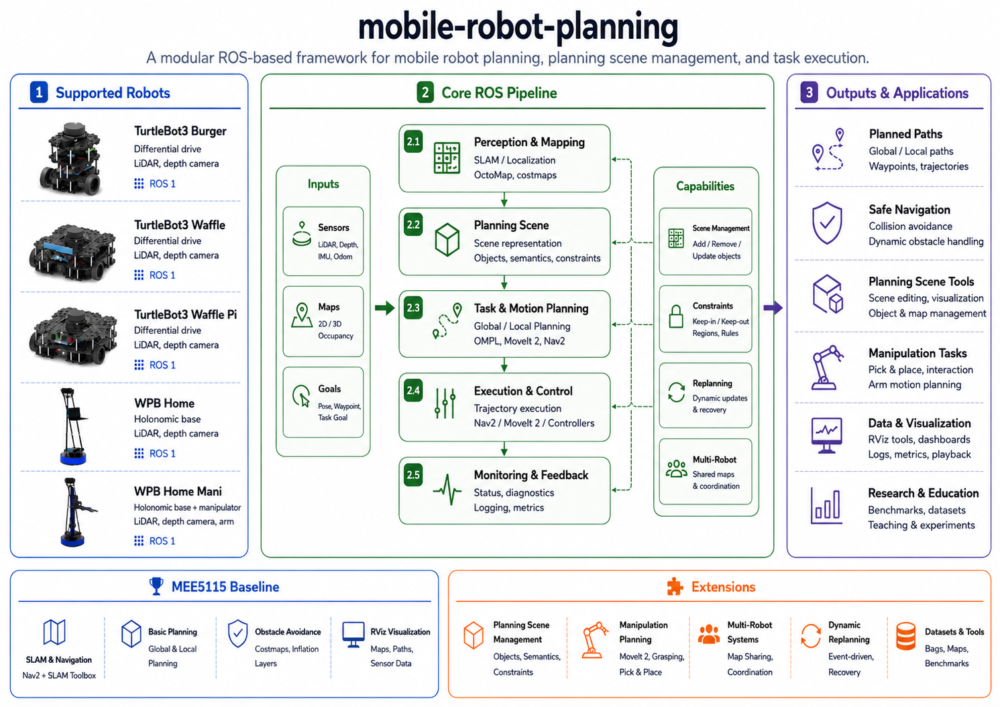

<div align="right">

[Chinese](README_zh.md)

</div>

# mobile-robot-planning

A ROS Noetic workspace for mobile robot simulation, SLAM, navigation, traditional path planning, coverage planning, and robot model migration.


This repository grew out of the `MEE5115 Autonomous Robotic Systems` course project. The original course baseline covered a Gazebo maze environment, ROS SLAM mapping, localization, and Navigation. This workspace keeps that baseline visible while reorganizing it into reusable ROS packages and extending it with multiple robot models, planner adapters, coverage planners, and a basic learning demo.

<p align="center">
  
</p>

The system overview covers robot descriptions, Gazebo sensors, SLAM/localization, global planning, local planning, coverage planning, the learning demo, and RViz/Gazebo outputs. Detailed launch arguments, limits, and topic semantics are kept in the topic documentation.

<p align="center">
  <video src="docs/mobile_robot_planning_readme_demo.mp4" controls muted playsinline width="85%">
    Your browser does not support embedded video playback.
  </video>
</p>

## Coverage Planning Notes

The two coverage-planning blog posts below were written by the repository author. They are useful companion notes for understanding BSA, Spiral-STC, and the coverage-planning ideas behind this workspace. The currently integrated coverage planners are BCD and STC; BSA and Spiral-STC are referenced as learning material, not as existing launch entries.

| Topic | Blog |
|---|---|
| BSA | [Backtracking Spiral Algorithm (BSA): priority-state-machine logic](https://blog.csdn.net/weixin_66211313/article/details/159582434) |
| Spiral-STC | [Spiral-STC: online coverage planning with two-level grids and macro topology](https://blog.csdn.net/weixin_66211313/article/details/159733957) |

## Status Legend

| Icon | Meaning |
|---|---|
| ✅ | Supported or available in the current repository |
| ❌ | Not implemented in the current repository |
| 🟣 | Partial, experimental, or model-only support |

## Current Scope

This is a learning and development workspace for mobile robot navigation and path-planning experiments. It should not be read as a complete general-purpose robotics platform.

| Area | Status | Notes |
|---|---:|---|
| Gazebo simulation | ✅ | Worlds, robot spawning, differential drive, laser, odometry, IMU, and camera interfaces |
| SLAM | ✅ | Basic `gmapping` and `hector` integration for mapping and course validation |
| Navigation | ✅ | `map_server`, AMCL, `move_base`, and DWA are wired together |
| Global planning | ✅ | `navfn` plus custom A*, Dijkstra, D*, D* Lite, Theta*, and RRT* adapters |
| Coverage planning | ✅ | BCD and STC generate coverage paths and execute waypoints through `/move_base` |
| Learning | 🟣 | Stage 1 DQN experimental demo, not a mature reinforcement-learning platform |
| Vision perception | ❌ | Some robot models expose camera topics, but no complete perception or visual SLAM pipeline is implemented |
| WPB Home Mani arm planning | ❌ | The model can be used as a mobile base; arm planning, MoveIt, and grasping are not implemented |

## Architecture

Point-to-point navigation:

```text
Robot Description
  -> Gazebo Simulation
  -> /scan /odom /tf
  -> Map Server or SLAM
  -> AMCL
  -> Global Planner
  -> Optional Smoother
  -> DWAPlannerROS
  -> /cmd_vel
```

Coverage tasks:

```text
Coverage Planner
  -> Coverage Path
  -> move_base action waypoints
  -> DWAPlannerROS
  -> /cmd_vel
```

Path topics have different meanings:

| Topic | Used for control | Meaning |
|---|---:|---|
| `/mr_traditional_planner/executed_global_path` | ✅ | Copy of the path returned by `GlobalPlannerAdapter` to `move_base` |
| `/mr_traditional_planner/debug_optimal_path` | ❌ | Standalone C++/Python planner output for comparison and debugging |
| `/move_base/DWAPlannerROS/global_plan` | ✅ | Global reference tracked by DWA |
| `/move_base/DWAPlannerROS/local_plan` | ✅ | Current short-horizon local trajectory selected by DWA |
| `/mr_traditional_planner/coverage_path` | 🟣 | Coverage path used indirectly through waypoint execution |

## Repository Layout

```text
mobile-robot-planning/
|-- README.md
|-- README_zh.md
|-- docs/
|   |-- index.md
|   |-- zh/
|   |-- mobile-robot-planning.png
|   `-- mobile_robot_planning_readme_demo.mp4
|-- src/
|   |-- mr_description/
|   |-- mr_gazebo/
|   |-- mr_maps/
|   |-- mr_slam/
|   |-- mr_navigation/
|   |-- mr_traditional_planner/
|   |-- mr_learning/
|   `-- mr_msgs/
|-- tools/
`-- refer/
```

## Supported Robots

| Robot key | Gazebo | SLAM | Navigation | Arm planning | Notes |
|---|---:|---:|---:|---:|---|
| `burger` | ✅ | ✅ | ✅ | ❌ | Default Quick Start model |
| `waffle` | ✅ | ✅ | ✅ | ❌ | Larger TurtleBot3-style base |
| `waffle_pi` | ✅ | ✅ | ✅ | ❌ | Camera topics are present; navigation still relies mainly on `/scan` |
| `wpb_home` | ✅ | ✅ | ✅ | ❌ | Official model plus simulation-only adaptation |
| `wpb_home_mani` | ✅ | ✅ | ✅ | ❌ | Mobile-base navigation only; no arm planning or grasping |

WPB Home migration keeps the official URDF and mesh assets, adds a simulation-only adaptation layer, and provides Gazebo differential-drive, laser, camera/depth, IMU, footprint, costmap, and DWA configuration.

## Planner Support

| Algorithm | Role | C++ | Python | `move_base` execution | Debug view | Status |
|---|---|---:|---:|---:|---:|---|
| `navfn` | ROS global planner | ✅ | ❌ | ✅ | ✅ | ✅ Baseline |
| A* | Global planner | ✅ | ✅ | ✅ | ✅ | ✅ Available |
| Dijkstra | Global planner | ✅ | ✅ | ✅ | ✅ | ✅ Available |
| D* | Global planner | ✅ | ✅ | ✅ | ✅ | 🟣 Static-costmap adaptation |
| D* Lite | Global planner | ✅ | ✅ | ✅ | ✅ | 🟣 Adapter exists; dynamic-obstacle evaluation is still needed |
| Theta* | Global planner | ✅ | ✅ | ✅ | ✅ | ✅ Available |
| RRT* | Global planner | ✅ | ✅ | ✅ | ✅ | ✅ Available |
| Cubic Spline | Path smoother | ✅ | ✅ | 🟣 | ✅ | 🟣 Smoother, not a standalone global planner |
| DWA | Local planning / debug | ✅ | ✅ | ✅ | ✅ | 🟣 Main chain uses ROS `DWAPlannerROS` |
| BCD | Coverage planner | ✅ | ✅ | 🟣 | ✅ | ✅ Waypoint execution through `/move_base` |
| STC | Coverage planner | ✅ | ✅ | 🟣 | ✅ | ✅ Waypoint execution through `/move_base` |

C++ handles pluginlib integration, `nav_core::BaseGlobalPlanner`, and the main navigation execution path. Python is mainly used for teaching, quick algorithm checks, debug visualization, and comparison.

## Quick Start

Target environment: Ubuntu 20.04, ROS Noetic, and Gazebo 11.

```bash
git clone https://github.com/Mingyang-Sheep/mobile-robot-planning.git
cd mobile-robot-planning
source /opt/ros/noetic/setup.bash
bash tools/check_environment.sh
sudo bash tools/install_dependencies.sh
catkin_make
source devel/setup.bash
roslaunch mr_navigation navigation_sim.launch
```

Default demo:

| Item | Value |
|---|---|
| Robot | `burger` |
| World | `src/mr_gazebo/worlds/turtlebot3_world.world` |
| Map | `src/mr_maps/maps/turtlebot3_world.yaml` |
| Initial pose | `x=-2.0`, `y=-0.5`, `yaw=0.0` |
| Launch entry | `mr_navigation/navigation_sim.launch` |

Common switches:

```bash
roslaunch mr_navigation navigation_sim.launch model:=waffle robot_model:=waffle
roslaunch mr_navigation navigation_sim.launch model:=wpb_home robot_model:=wpb_home
roslaunch mr_navigation navigation_sim.launch global_planner:=theta_star path_smoother:=cubic_spline
roslaunch mr_navigation navigation_sim.launch planning_mode:=coverage coverage_planner:=stc
```

## Documentation

| Category | Documents |
|---|---|
| Getting Started | [Installation](docs/installation.md), [Quick Start](docs/quick_start.md), [Launch Reference](docs/launch_reference.md) |
| Robots and Simulation | [Robot Models](docs/robot_models.md), [Gazebo Simulation](docs/gazebo_simulation.md), [URDF Migration](docs/import_robot_urdf_to_navigation.md), [URDF Migration Entry](docs/URDF_MIGRATION_GUIDE.md) |
| Mapping and Navigation | [SLAM Mapping](docs/slam_mapping.md), [Navigation](docs/navigation.md), [Topics and TF](docs/topics_and_tf.md), [Configuration Reference](docs/configuration_reference.md) |
| Planning | [Planner Framework](docs/planner_framework.md), [Point-to-Point Planners](docs/optimal_path_planners.md), [Coverage Planning](docs/coverage_path_planning.md), [Learning Planning](docs/learning_planning.md) |
| Development and Troubleshooting | [Repository Architecture](docs/repository_architecture.md), [Documentation Management](docs/documentation_management.md), [Troubleshooting](docs/troubleshooting.md), [References](docs/references.md) |

## References

This workspace references ROS Navigation, TurtleBot3/ROBOTIS, WPB Home, WPR Simulation, PythonRobotics, and course material. Third-party notices are kept in [src/mr_traditional_planner/THIRD_PARTY_NOTICES.md](src/mr_traditional_planner/THIRD_PARTY_NOTICES.md), and the full reference list is in [docs/references.md](docs/references.md).
