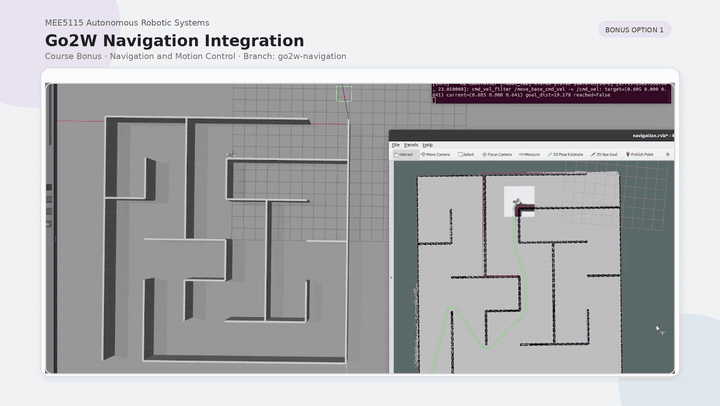

<div align="right">

[Chinese](README_zh.md)

</div>

# mobile-robot-planning: go2w-navigation Bonus Branch


This branch preserves the `MEE5115 Autonomous Robotic Systems` course bonus
implementation for Go2W navigation in simulation. It integrates a Go2W model,
RL-SAR locomotion control, Gazebo, AMCL, `move_base`, Navfn, DWA, and RViz goal
input into a single ROS Noetic launch path.

## Branch Positioning

`go2w-navigation` is a course bonus display branch, not the recommended
development trunk.

| Branch | Role |
|---|---|
| `main` | Recommended entry for the baseline framework, future development, and general learning |
| `go2w-navigation` | Course bonus branch for the Go2W + RL-SAR + ROS Navigation simulation chain |

This branch is kept to show the completed baseline + bonus course result. It is
not planned to be merged back into `main`.

## Relationship with `main`

For the latest baseline framework and future development, please start from the
[`main` branch](https://github.com/Mingyang-Sheep/mobile-robot-planning/tree/main).

The `main` branch documents the reusable baseline workspace: TurtleBot3 / WPB
Home simulation, SLAM, Navigation, traditional planners, coverage planners, and
the general documentation set. This branch is narrower and keeps the Go2W course
bonus chain reproducible.

## Demo



The GIF shows Go2W in the `maze_2` scene receiving an RViz `2D Nav Goal`.
ROS Navigation generates velocity commands, and the RL-SAR policy turns those
commands into wheel-leg motion control in Gazebo.

## What This Branch Adds

Compared with the baseline navigation workspace, this branch adds the following
Go2W-specific pieces that exist in the current tree:

| Area | Files or packages |
|---|---|
| Go2W robot model | `src/go2w_description/` |
| RL-SAR simulation controller | `src/rl_sar/` |
| Motor messages and Gazebo joint controller | `src/robot_msgs/`, `src/robot_joint_controller/` |
| Go2W policy assets | `policy/go2w/base.yaml`, `policy/go2w/robot_lab/policy.pt` |
| Inference runtime helper | `scripts/download_inference_runtime.sh` |
| Go2W navigation launch entry | `src/mr_navigation/launch/go2w_navigation_sim.launch` |
| Velocity adapter | `src/mr_navigation/scripts/cmd_vel_filter.py` |
| Gazebo odometry bridge | `src/mr_gazebo/scripts/gazebo_model_odom.py` |
| Go2W costmap and DWA parameters | `src/mr_navigation/config/*_go2w.yaml` |
| Maze navigation setup | `src/mr_gazebo/worlds/maze_2.world`, `src/mr_maps/maps/maze_2_hector.yaml` |

## System Overview

The branch uses the standard ROS Navigation stack for global and local planning,
then adapts the resulting velocity commands for RL-SAR locomotion:

```text
RViz 2D Nav Goal
  -> map_server + AMCL
  -> NavfnROS
  -> DWAPlannerROS
  -> /move_base_cmd_vel
  -> cmd_vel_filter.py
  -> /cmd_vel
  -> rl_sar / rl_sim
  -> policy/go2w/robot_lab/policy.pt
  -> robot_joint_controller
  -> Gazebo Go2W
```

## Data Flow

Command path:

```text
RViz 2D Nav Goal
-> NavfnROS
-> DWAPlannerROS
-> /move_base_cmd_vel
-> cmd_vel_filter.py
-> /cmd_vel
-> rl_sar / rl_sim
-> policy.pt
-> robot_joint_controller
-> Gazebo Go2W
```

Feedback path:

```text
Gazebo model states
-> gazebo_model_odom.py
-> /odom + odom -> base_footprint
-> AMCL
-> map -> odom
```

Laser path:

```text
Gazebo Go2W base_scan
-> /scan
-> AMCL + local/global costmaps
```

## Requirements

Target environment:

| Item | Expected value |
|---|---|
| OS | Ubuntu 20.04 |
| ROS | ROS Noetic |
| Simulator | Gazebo 11 |
| Main policy runtime | LibTorch |
| Navigation stack | `map_server`, AMCL, `move_base`, Navfn, DWA |

The TorchScript policy is expected at:

```text
policy/go2w/robot_lab/policy.pt
```

## Build

```bash
cd ~/mobile-robot-planning
source /opt/ros/noetic/setup.bash

bash scripts/download_inference_runtime.sh libtorch
catkin_make -DBUILD_RL_REAL_TARGETS=OFF
source devel/setup.bash
```

`BUILD_RL_REAL_TARGETS=OFF` is used because this branch runs the RL-SAR control
chain in Gazebo simulation and does not build hardware executables that depend on
vendor SDKs.

## Quick Start

```bash
cd ~/mobile-robot-planning
source /opt/ros/noetic/setup.bash
source devel/setup.bash

roslaunch mr_navigation go2w_navigation_sim.launch
```

Default launch values:

| Item | Value |
|---|---|
| World | `mr_gazebo/worlds/maze_2.world` |
| Map | `maze_2_hector` |
| Robot | `go2w` |
| Gazebo model | `go2w_gazebo` |
| Policy | `policy/go2w/robot_lab/policy.pt` |
| Velocity chain | `/move_base_cmd_vel -> /cmd_vel` |
| Navigation planner | `NavfnROS + DWAPlannerROS` |

In RViz:

1. Wait for Gazebo, RL-SAR get-up, locomotion mode, AMCL, and `move_base`.
2. Use `2D Pose Estimate` if the robot pose and map do not align.
3. Use `2D Nav Goal` to send a target.

## Useful Commands

```bash
rostopic echo /move_base_cmd_vel
rostopic echo /cmd_vel
rostopic hz /scan
rostopic hz /odom
rosrun tf tf_echo map base_footprint
rosrun tf tf_echo base_footprint base
```

Useful launch switches:

```bash
roslaunch mr_navigation go2w_navigation_sim.launch x:=1.7 y:=0.8 yaw:=1.5708
roslaunch mr_navigation go2w_navigation_sim.launch rviz:=false
roslaunch mr_navigation go2w_navigation_sim.launch auto_locomotion_delay:=9.0
roslaunch mr_navigation go2w_navigation_sim.launch use_cmd_vel_filter:=false
```

## How to Verify the Navigation Chain

After launching, check the chain from perception to control:

| Check | Command | Expected result |
|---|---|---|
| Laser | `rostopic hz /scan` | About 10 Hz |
| Odometry | `rostopic hz /odom` | About 30 Hz |
| Raw DWA command | `rostopic echo /move_base_cmd_vel` | Nonzero after a valid goal |
| Filtered RL command | `rostopic echo /cmd_vel` | Limited, smoothed command |
| Localization TF | `rosrun tf tf_echo map base_footprint` | Continuous transform |
| Base height TF | `rosrun tf tf_echo base_footprint base` | Static height offset |

The expected TF chain is:

```text
map -> odom -> base_footprint -> base -> trunk -> base_scan
```

More detailed checks are in
[docs/go2w_rl_sar_navigation.md](docs/go2w_rl_sar_navigation.md).

## Repository Changes

The former root-level Go2W notes were converted into formal branch documents:

| New document | Purpose |
|---|---|
| [docs/go2w_rl_sar_navigation.md](docs/go2w_rl_sar_navigation.md) | User guide for running, verifying, and troubleshooting the Go2W navigation demo |
| [docs/go2w_integration_guide.md](docs/go2w_integration_guide.md) | Developer guide describing the file-level Go2W + RL-SAR integration |
| [docs/zh/go2w_rl_sar_navigation.md](docs/zh/go2w_rl_sar_navigation.md) | Chinese version of the user guide |
| [docs/zh/go2w_integration_guide.md](docs/zh/go2w_integration_guide.md) | Chinese version of the developer guide |

The branch demo asset is self-contained at:

```text
docs/assets/08_go2w_bonus.gif
```

## Notes and Limitations

- This is a course bonus branch focused on a Go2W simulation navigation loop.
- The default chain is Navfn + DWA + RL-SAR locomotion policy.
- The Go2W low-level motion is produced by a pretrained policy; this repository
  does not retrain that policy.
- Real robot deployment is outside the documented branch scope.
- This branch is not a replacement for `main`.
- For continued development of the mobile robot planning framework, start from
  the `main` branch.
- `dwa_local_planner_params_go2w.yaml` still contains a private
  `DWAPlannerROS/controller_frequency: 10.0`; the launch file overrides the
  `move_base` controller frequency to 20 Hz for this demo.

## Troubleshooting

### `unitree_sdk2` missing `CMakeLists.txt`

**Reason:** Hardware SDK sources are not required for the Gazebo-only demo, but
unconditional hardware target builds can look for them.

**Fix:** Build with:

```bash
catkin_make -DBUILD_RL_REAL_TARGETS=OFF
```

### `/move_base_cmd_vel` changes but `/cmd_vel` is too small

**Reason:** The velocity filter is limiting speed, yaw rate, or acceleration.

**Fix:** Inspect `cmd_vel_filter.py` parameters through
`go2w_navigation_sim.launch`, especially `cmd_vel_min_x`, `cmd_vel_max_x`,
`cmd_vel_max_yaw`, and acceleration limits.

### `/move_base_cmd_vel` is almost zero

**Reason:** The local planner may not have a valid localized pose, goal, or local
costmap.

**Fix:** Check AMCL, the RViz goal, `/scan`, `/odom`, and TF alignment before
changing RL-SAR parameters.

### Laser points do not align with the map

**Reason:** AMCL initial pose, map origin, or the `map -> odom -> base_scan`
transform may be wrong.

**Fix:** Use `2D Pose Estimate`, then check:

```bash
rostopic echo -n 1 /scan/header
rosrun tf tf_echo map base_scan
```

### Go2W reaches the target area but keeps rotating

**Reason:** A wheel-leg policy may not benefit from strict final yaw alignment in
the maze demo.

**Fix:** This branch uses a relaxed yaw tolerance and the goal-stop latch in
`cmd_vel_filter.py`. Confirm `goal_stop_enabled` and `goal_xy_tolerance` in the
launch file.

## References

- [Repository `main` branch](https://github.com/Mingyang-Sheep/mobile-robot-planning/tree/main)
- [fan-ziqi / rl_sar](https://github.com/fan-ziqi/rl_sar), the upstream
  reference repository used by the Go2W course bonus integration
- [ROS Navigation stack](http://wiki.ros.org/navigation)
- RL-SAR upstream project and Go2W policy/model assets imported into
  `src/rl_sar`, `src/go2w_description`, `policy/go2w`, and
  `src/robot_joint_controller`
- Local branch documents:
  [Go2W navigation guide](docs/go2w_rl_sar_navigation.md) and
  [Go2W integration guide](docs/go2w_integration_guide.md)
